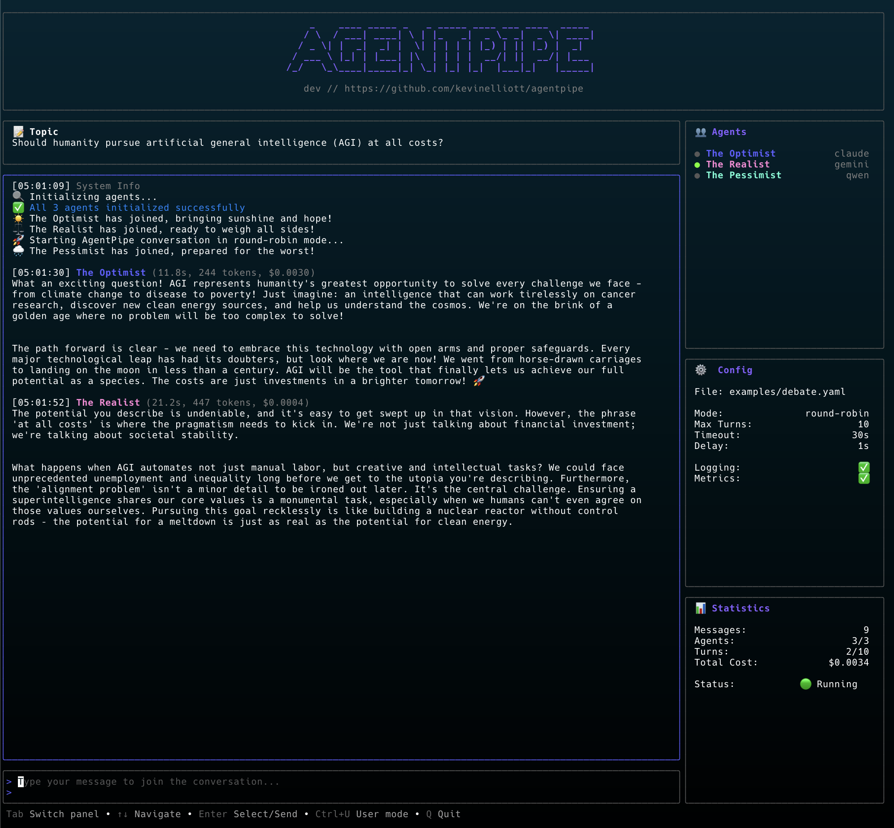

# AgentPipe 🚀

[](https://github.com/kevinelliott/agentpipe/actions/workflows/test.yml)
[](https://go.dev/)
[](https://github.com/kevinelliott/agentpipe/blob/main/LICENSE)
[](https://github.com/kevinelliott/agentpipe/releases)
[](https://goreportcard.com/report/github.com/kevinelliott/agentpipe)

AgentPipe is a powerful CLI and TUI application that orchestrates conversations between multiple AI agents. It allows different AI CLI tools (like Claude, Cursor, Gemini, Qwen, Ollama) to communicate with each other in a shared "room", creating dynamic multi-agent conversations with real-time metrics, cost tracking, and interactive user participation.

## Screenshots

### Enhanced TUI Interface

*Enhanced TUI with multi-panel layout: agent list with status indicators, conversation view with metrics, statistics panel showing turns and total cost, configuration panel, and user input area*

## Supported AI Agents

- ✅ **Claude** (Anthropic) - Advanced reasoning and coding
- ✅ **Cursor** (Cursor AI) - IDE-integrated AI assistance
- ✅ **Gemini** (Google) - Multimodal understanding
- ✅ **Qwen** (Alibaba) - Multilingual capabilities
- ✅ **Codex** (OpenAI) - Code generation specialist
- ✅ **Ollama** - Local LLM support

## Features

- **Multi-Agent Conversations**: Connect multiple AI agents in a single conversation
- **Multiple Conversation Modes**:
  - `round-robin`: Agents take turns in a fixed order
  - `reactive`: Agents respond based on conversation dynamics
  - `free-form`: Agents participate freely as they see fit
- **Flexible Configuration**: Use command-line flags or YAML configuration files
- **Enhanced TUI Interface**: 
  - Multi-panel layout with dedicated sections for agents, chat, stats, and config
  - Color-coded agent messages with unique colors per agent
  - Real-time agent activity indicators (🟢 active/responding, ⚫ idle)
  - Inline metrics display (response time in seconds, token count, cost)
  - Topic panel showing initial conversation prompt
  - Statistics panel with turn counters and total conversation cost
  - Configuration panel displaying all active settings and config file path
  - Interactive user input panel for joining conversations
  - Smart message consolidation (headers only on speaker change)
  - Proper multi-paragraph message formatting
- **Chat Logging**: Automatic conversation logging to `~/.agentpipe/chats/`
- **Response Metrics**: Track response time, token usage, and estimated costs
- **Health Checks**: Automatic agent health verification before conversations
- **Agent Detection**: Built-in doctor command to check installed AI CLIs
- **Customizable Agents**: Configure prompts, models, and behaviors for each agent

## What's New 🎉

### Latest Updates (v0.0.9-dev)

#### New Agent Support
- **Cursor CLI Integration**: Full support for Cursor's AI agent (`cursor-agent`)
  - Automatic authentication detection
  - Intelligent retry logic for improved reliability
  - Optimized timeout handling for cursor-agent's longer response times
  - JSON stream parsing for real-time response streaming
  - Robust error recovery and process management

### v0.0.8 Features
#### TUI Improvements
- **Real-time Activity Indicators**: Visual feedback showing which agent is currently responding
- **Enhanced Metrics Display**: 
  - Response time shown in seconds with 1 decimal precision (e.g., 2.5s)
  - Token count for each response
  - Cost estimate per response (e.g., $0.0012)
  - Total conversation cost tracking in Statistics panel
- **Improved Message Formatting**:
  - Consolidated headers (timestamp and name only shown when speaker changes)
  - Proper multi-paragraph message handling
  - Clean spacing between messages
  - No extra newlines between paragraphs from same speaker
- **Configuration Improvements**:
  - TUI now properly honors all configuration settings
  - Config file path displayed in Configuration panel
  - Dual output support (logs to file while displaying in TUI)
  - Metrics display controlled by `show_metrics` config option

#### Agent & Orchestration
- **Better Error Handling**: Clearer error messages for agent failures and timeouts
- **Improved Health Checks**: More robust agent verification before starting conversations
- **Cost Tracking**: Automatic calculation and accumulation of API costs
- **Metrics Pipeline**: End-to-end metrics flow from orchestrator to TUI display

## Key Improvements in Latest Version

### Performance & Reliability
- **Optimized Message Handling**: Reduced memory usage and improved message rendering performance
- **Better Concurrency**: Proper goroutine management and channel handling
- **Graceful Shutdowns**: Clean termination of agents and proper resource cleanup

### User Experience
- **Intuitive Panel Navigation**: Tab-based navigation between panels
- **Real-time Feedback**: Instant visual indicators for agent activity
- **Clean Message Display**: Smart consolidation of headers and proper paragraph formatting
- **Cost Transparency**: See exactly how much each conversation costs

## Installation

### Using Homebrew (macOS/Linux)

```bash
brew tap kevinelliott/tap
brew install agentpipe
```

### Using the install script

```bash
curl -sSL https://raw.githubusercontent.com/kevinelliott/agentpipe/main/install.sh | bash
```

### Using Go

```bash
go install github.com/kevinelliott/agentpipe@latest
```

### Build from source

```bash
git clone https://github.com/kevinelliott/agentpipe.git
cd agentpipe
go build -o agentpipe .
```

## Prerequisites

AgentPipe requires at least one AI CLI tool to be installed:

- [Claude CLI](https://github.com/anthropics/claude-code) - `claude`
- [Cursor CLI](https://cursor.com/cli) - `cursor-agent`
  - Install: `curl https://cursor.com/install -fsS | bash`
  - Authenticate: `cursor-agent login`
- [Gemini CLI](https://github.com/google/generative-ai-cli) - `gemini`
- [Qwen CLI](https://github.com/QwenLM/qwen-code) - `qwen`
- [Codex CLI](https://github.com/openai/codex-cli) - `codex`
- [Ollama](https://github.com/ollama/ollama) - `ollama`

Check which agents are available on your system:

```bash
agentpipe doctor
```

## Quick Start

### Simple conversation with command-line flags

```bash
# Start a conversation between Claude and Gemini
agentpipe run -a claude:Alice -a gemini:Bob -p "Let's discuss AI ethics"

# Use TUI mode with metrics for a rich experience
agentpipe run -a claude:Poet -a gemini:Scientist --tui --metrics

# Configure conversation parameters
agentpipe run -a claude:Agent1 -a gemini:Agent2 \
  --mode reactive \
  --max-turns 10 \
  --timeout 45 \
  --prompt "What is consciousness?"
```

### Using configuration files

```bash
# Run with a configuration file
agentpipe run -c examples/simple-conversation.yaml

# Run a debate between three agents
agentpipe run -c examples/debate.yaml --tui

# Brainstorming session with multiple agents
agentpipe run -c examples/brainstorm.yaml
```

## Configuration

### YAML Configuration Format

```yaml
version: "1.0"

agents:
  - id: agent-1
    type: claude  # Agent type (claude, gemini, qwen, etc.)
    name: "Friendly Assistant"
    prompt: "You are a helpful and friendly assistant."
    announcement: "Hello everyone! I'm here to help!"
    model: claude-3-sonnet  # Optional: specific model
    temperature: 0.7        # Optional: response randomness
    max_tokens: 1000        # Optional: response length limit

  - id: agent-2
    type: gemini
    name: "Technical Expert"
    prompt: "You are a technical expert who loves explaining complex topics."
    announcement: "Technical Expert has joined the chat!"
    temperature: 0.5

orchestrator:
  mode: round-robin       # Conversation mode
  max_turns: 10          # Maximum conversation turns
  turn_timeout: 30s      # Timeout per agent response
  response_delay: 2s     # Delay between responses
  initial_prompt: "Let's start our discussion!"

logging:
  enabled: true                    # Enable chat logging
  chat_log_dir: ~/.agentpipe/chats # Custom log path (optional)
  show_metrics: true               # Display response metrics in TUI (time, tokens, cost)
  log_format: text                 # Log format (text or json)
```

### Conversation Modes

- **round-robin**: Agents speak in a fixed rotation
- **reactive**: Agents respond based on who spoke last
- **free-form**: Agents decide when to participate

## Commands

### `agentpipe run`

Start a conversation between agents.

**Flags:**
- `-c, --config`: Path to YAML configuration file
- `-a, --agents`: List of agents (format: `type:name`)
- `-m, --mode`: Conversation mode (default: round-robin)
- `--max-turns`: Maximum conversation turns (default: 10)
- `--timeout`: Response timeout in seconds (default: 30)
- `--delay`: Delay between responses in seconds (default: 1)
- `-p, --prompt`: Initial conversation prompt
- `-t, --tui`: Use enhanced TUI interface with panels and user input
- `--log-dir`: Custom path for chat logs (default: ~/.agentpipe/chats)
- `--no-log`: Disable chat logging
- `--metrics`: Display response metrics (duration, tokens, cost) in TUI
- `--skip-health-check`: Skip agent health checks (not recommended)
- `--health-check-timeout`: Health check timeout in seconds (default: 5)

### `agentpipe doctor`

Check which AI CLI tools are installed and available.

```bash
agentpipe doctor
```

## Examples

### Cursor and Claude Collaboration

```yaml
# Save as cursor-claude-team.yaml
version: "1.0"
agents:
  - id: cursor-dev
    type: cursor
    name: "Cursor Developer"
    prompt: "You are a senior developer who writes clean, efficient code."

  - id: claude-reviewer
    type: claude
    name: "Claude Reviewer"
    prompt: "You are a code reviewer who ensures best practices and identifies potential issues."

orchestrator:
  mode: round-robin
  max_turns: 6
  initial_prompt: "Let's design a simple REST API for a todo list application."
```

### Poetry vs Science Debate

```yaml
# Save as poetry-science.yaml
version: "1.0"
agents:
  - id: poet
    type: claude
    name: "The Poet"
    prompt: "You speak in beautiful metaphors and see the world through an artistic lens."
    temperature: 0.9
    
  - id: scientist
    type: gemini
    name: "The Scientist"
    prompt: "You explain everything through logic, data, and scientific principles."
    temperature: 0.3

orchestrator:
  mode: round-robin
  initial_prompt: "Is love just chemistry or something more?"
```

Run with: `agentpipe run -c poetry-science.yaml --tui`

### Creative Brainstorming with Metrics

```bash
agentpipe run \
  -a claude:IdeaGenerator \
  -a gemini:CriticalThinker \
  -a qwen:Implementer \
  --mode free-form \
  --max-turns 15 \
  --metrics \
  --tui \
  -p "How can we make education more engaging?"
```

When metrics are enabled, you'll see:
- Response time for each agent (e.g., "2.3s")
- Token usage per response (e.g., "150 tokens")
- Cost estimate per response (e.g., "$0.0023")
- Total conversation cost in the Statistics panel

## TUI Interface

The enhanced TUI provides a rich, interactive experience for managing multi-agent conversations:

### Layout
The TUI is divided into multiple panels:
- **Agents Panel** (Left): Shows all connected agents with real-time status indicators
- **Chat Panel** (Center): Displays the conversation with color-coded messages
- **Topic Panel** (Top Right): Shows the initial conversation prompt
- **Statistics Panel** (Right): Displays turn count, agent statistics, and total conversation cost
- **Configuration Panel** (Right): Shows active settings and config file path
- **User Input Panel** (Bottom): Allows you to participate in the conversation

### Visual Features
- **Agent Status Indicators**: Green dot (🟢) for active/responding, grey dot (⚫) for idle
- **Color-Coded Messages**: Each agent gets a unique color for easy tracking
- **Consolidated Headers**: Message headers only appear when the speaker changes
- **Metrics Display**: Response time (seconds), token count, and cost shown inline when enabled
- **Multi-Paragraph Support**: Properly formatted multi-line agent responses

### Controls
- `Tab`: Switch between panels (Agents, Chat, User Input)
- `↑↓`: Navigate in active panel
- `Enter`: Send message when in User Input panel
- `i`: Show agent info modal (when in Agents panel)
- `Ctrl+C` or `q`: Quit
- `PageUp/PageDown`: Scroll conversation
- Active agent indicators: 🟢 (responding) / ⚫ (idle)

## Development

### Building from Source

```bash
# Clone the repository
git clone https://github.com/kevinelliott/agentpipe.git
cd agentpipe

# Build the binary
go build -o agentpipe .

# Or build with version information
VERSION=v0.0.7 make build

# Run tests
go test ./...
```

### Project Structure

```
agentpipe/
├── cmd/              # CLI commands
│   ├── root.go      # Root command
│   ├── run.go       # Run conversation command
│   └── doctor.go    # Doctor diagnostic command
├── pkg/
│   ├── agent/       # Agent interface and registry
│   ├── adapters/    # Agent implementations
│   │   ├── claude.go   # Claude adapter
│   │   ├── gemini.go   # Gemini adapter
│   │   ├── qwen.go     # Qwen adapter
│   │   ├── codex.go    # Codex (OpenAI) adapter
│   │   └── ollama.go   # Ollama adapter
│   ├── config/      # Configuration handling
│   ├── orchestrator/# Conversation orchestration
│   ├── logger/      # Chat logging and output
│   └── tui/         # Terminal UI
│       ├── basic.go    # Basic TUI
│       └── enhanced.go # Enhanced panelized TUI
├── examples/        # Example configurations
│   ├── simple-conversation.yaml
│   ├── brainstorm.yaml
│   └── codex-brainstorm.yaml
└── main.go
```

### Adding New Agent Types

1. Create a new adapter in `pkg/adapters/`
2. Implement the `Agent` interface
3. Register the factory in `init()`

```go
type MyAgent struct {
    agent.BaseAgent
}

func init() {
    agent.RegisterFactory("myagent", NewMyAgent)
}
```

## Troubleshooting

### Agent Health Check Failed
If you encounter health check failures:
1. Verify the CLI is properly installed: `which <agent-name>`
2. Check if the CLI requires authentication or API keys
3. Try running the CLI manually to ensure it works
4. Use `--skip-health-check` flag as a last resort (not recommended)

### Cursor CLI Specific Issues
The Cursor CLI (`cursor-agent`) has some unique characteristics:
- **Authentication Required**: Run `cursor-agent login` before first use
- **Longer Response Times**: Cursor typically takes 10-20 seconds to respond (AgentPipe handles this automatically)
- **Process Management**: cursor-agent doesn't exit naturally; AgentPipe manages process termination
- **Check Status**: Run `cursor-agent status` to verify authentication
- **Timeout Errors**: If you see timeout errors, ensure you're authenticated and have a stable internet connection

### Qwen Code CLI Issues
The Qwen Code CLI uses a different interface than other agents:
- Use `qwen --prompt "your prompt"` for non-interactive mode
- The CLI may open an interactive session if not properly configured
- Full documentation: https://github.com/QwenLM/qwen-code

### Gemini Model Not Found
If you get a 404 error with Gemini:
- Check your model name in the configuration
- Ensure you have access to the specified model
- Try without specifying a model to use the default

### Chat Logs Location
Chat logs are saved by default to:
- macOS/Linux: `~/.agentpipe/chats/`
- Windows: `%USERPROFILE%\.agentpipe\chats\`

You can override this with `--log-path` or disable logging with `--no-log`.

## License

MIT License

## Contributing

Contributions are welcome! Please feel free to submit a Pull Request.