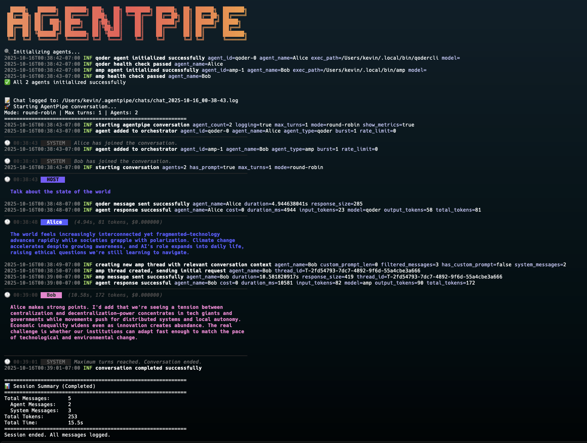
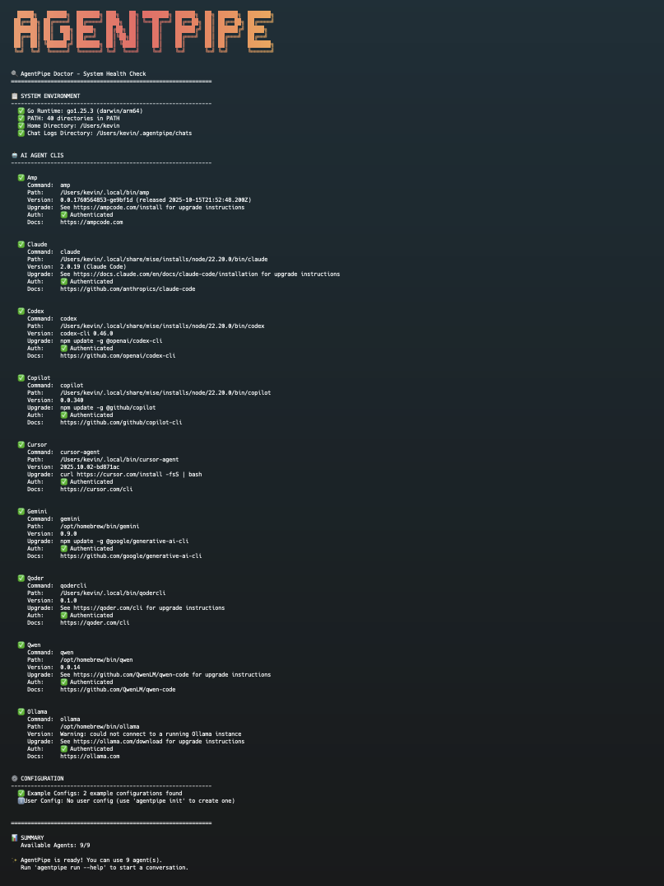

# AgentPipe 🚀


[](https://github.com/kevinelliott/agentpipe/actions/workflows/test.yml)
[](https://go.dev/)
[](https://github.com/kevinelliott/agentpipe/blob/main/LICENSE)
[](https://github.com/kevinelliott/agentpipe/releases)
[](https://goreportcard.com/report/github.com/kevinelliott/agentpipe)

AgentPipe is a powerful CLI and TUI application that orchestrates conversations between multiple AI agents. It allows different AI CLI tools (like Claude, Cursor, Gemini, Qwen, Ollama) to communicate with each other in a shared "room", creating dynamic multi-agent conversations with real-time metrics, cost tracking, and interactive user participation.

## Screenshots

### Enhanced TUI Interface

*Enhanced TUI with multi-panel layout: agent list with status indicators, conversation view with metrics, statistics panel showing turns and total cost, configuration panel, and user input area*

### Console/CLI Interface

*CLI output showing color-coded agent messages with agent type indicators (e.g., "Alice (qoder)"), HOST vs SYSTEM distinction, and inline metrics display*

## Supported AI Agents

All agents now use a **standardized interaction pattern** with structured three-part prompts, message filtering, and comprehensive logging for reliable multi-agent conversations.

- ✅ **Amp** (Sourcegraph) - Advanced coding agent with autonomous reasoning ⚡ **Thread-optimized**
- ✅ **Claude** (Anthropic) - Advanced reasoning and coding
- ✅ **Codex** (OpenAI) - Code generation specialist (non-interactive exec mode)
- ✅ **Copilot** (GitHub) - Terminal-based coding agent with multiple model support
- ✅ **Cursor** (Cursor AI) - IDE-integrated AI assistance
- ✅ **Gemini** (Google) - Multimodal understanding
- ✅ **Qoder** - Agentic coding platform with enhanced context engineering
- ✅ **Qwen** (Alibaba) - Multilingual capabilities
- ✅ **Ollama** - Local LLM support (planned)

## Features

### Core Capabilities
- **Multi-Agent Conversations**: Connect multiple AI agents in a single conversation
- **Multiple Conversation Modes**:
  - `round-robin`: Agents take turns in a fixed order
  - `reactive`: Agents respond based on conversation dynamics
  - `free-form`: Agents participate freely as they see fit
- **Flexible Configuration**: Use command-line flags or YAML configuration files

### Enhanced TUI Interface
- Multi-panel layout with dedicated sections for agents, chat, stats, and config
- Color-coded agent messages with unique colors per agent
- **Agent type indicators** showing agent type in parentheses (e.g., "Alice (qoder)")
- **Branded sunset logo** with gradient colors
- Real-time agent activity indicators (🟢 active/responding, ⚫ idle)
- Inline metrics display (response time in seconds, token count, cost)
- **Conversation search** (Ctrl+F) with n/N navigation through results
- **Agent filtering** via slash commands (/filter, /clear)
- **Help modal** (?) showing all keyboard shortcuts
- Topic panel showing initial conversation prompt
- Statistics panel with turn counters and total conversation cost
- Configuration panel displaying all active settings and config file path
- Interactive user input panel for joining conversations
- Smart message consolidation (headers only on speaker change)
- Proper multi-paragraph message formatting

### Production Features
- **Prometheus Metrics**: Comprehensive observability with 10+ metrics types
  - Request rates, durations, errors
  - Token usage and cost tracking
  - Active conversations, retry attempts, rate limit hits
  - HTTP server with `/metrics`, `/health`, and web UI endpoints
  - Ready for Grafana dashboards and alerting
- **Conversation Management**:
  - Save/resume conversations from state files
  - Export to JSON, Markdown, or HTML formats
  - Automatic chat logging to `~/.agentpipe/chats/`
- **Reliability & Performance**:
  - Rate limiting per agent with token bucket algorithm
  - Retry logic with exponential backoff (configurable)
  - Structured error handling with error types
  - Config hot-reload for development workflows
- **Middleware Pipeline**: Extensible message processing
  - Built-in: logging, metrics, validation, sanitization, filtering
  - Custom middleware support for transforms and filters
  - Error recovery and panic handling
- **Docker Support**: Multi-stage builds, docker-compose, production-ready
- **Health Checks**: Automatic agent health verification before conversations
- **Agent Detection**: Built-in doctor command to check installed AI CLIs
- **Customizable Agents**: Configure prompts, models, and behaviors for each agent

## What's New

See [CHANGELOG.md](CHANGELOG.md) for detailed version history and release notes.

**Latest Release**: v0.1.0 - Enhanced TUI with agent type indicators, branded sunset logo, improved reliability with better error handling, and proper version display with build information.

**What's New in v0.1.0**:

✨ **Major Features:**
- **Agent Type Indicators**: Message badges now display agent type in parentheses (e.g., "Alice (qoder)") for quick identification
- **Branded Sunset Logo**: Beautiful ASCII art logo with gradient colors in both CLI and TUI
- **Enhanced HOST/SYSTEM Distinction**: Clear visual separation between orchestrator prompts (HOST) and system notifications (SYSTEM)
- **Proper Version Display**: Shows version, commit hash, and build date in `agentpipe version`

🚀 **Improvements:**
- **Improved Gemini Adapter**: Better error handling for process exit issues, reduces false failures
- **Consistent Badge Colors**: Fixed race condition ensuring agent badges always show correct colors
- **Enhanced Output Cleaning**: Filters error traces and stack dumps from agent responses

🐛 **Bug Fixes:**
- Fixed TUI display corruption from stderr output interference
- Fixed version information not displaying correctly in builds
- Fixed inconsistent agent badge colors on first message

📚 **Documentation:**
- Added console and doctor command screenshots to README
- Comprehensive CHANGELOG updates with all changes

## Installation

### Using Homebrew (macOS/Linux)

```bash
brew tap kevinelliott/tap
brew install agentpipe
```

### Using the install script

```bash
curl -sSL https://raw.githubusercontent.com/kevinelliott/agentpipe/main/install.sh | bash
```

### Using Go

```bash
go install github.com/kevinelliott/agentpipe@latest
```

### Build from source

```bash
git clone https://github.com/kevinelliott/agentpipe.git
cd agentpipe
go build -o agentpipe .
```

## Prerequisites

AgentPipe requires at least one AI CLI tool to be installed:

- [Amp CLI](https://ampcode.com) - `amp` ⚡ **Optimized**
  - Install: See [installation guide](https://ampcode.com/install)
  - Authenticate: Follow Amp documentation
  - Features: Autonomous coding, IDE integration, complex task execution
  - **Thread Management**: AgentPipe uses Amp's native threading to maintain server-side conversation state
  - **Smart Filtering**: Only sends new messages from other agents, reducing API costs by 50-90%
  - **Structured Context**: Initial prompts are delivered in a clear, three-part structure
- [Claude CLI](https://github.com/anthropics/claude-code) - `claude`
  - Install: See [installation guide](https://docs.claude.com/en/docs/claude-code/installation)
  - Authenticate: Run `claude` and follow authentication prompts
  - Features: Advanced reasoning, coding, complex task execution
- [GitHub Copilot CLI](https://github.com/github/copilot-cli) - `copilot`
  - Install: `npm install -g @github/copilot`
  - Authenticate: Launch `copilot` and use `/login` command
  - Requires: Node.js v22+, npm v10+, and active GitHub Copilot subscription
- [Cursor CLI](https://cursor.com/cli) - `cursor-agent`
  - Install: `curl https://cursor.com/install -fsS | bash`
  - Authenticate: `cursor-agent login`
- [Gemini CLI](https://github.com/google/generative-ai-cli) - `gemini`
- [Qoder CLI](https://qoder.com/cli) - `qodercli`
  - Install: See [installation guide](https://qoder.com/cli)
  - Authenticate: Run `qodercli` and use `/login` command
  - Features: Enhanced context engineering, intelligent agents, MCP integration, built-in tools
- [Qwen CLI](https://github.com/QwenLM/qwen-code) - `qwen`
- [Codex CLI](https://github.com/openai/codex-cli) - `codex`
  - Uses `codex exec` subcommand for non-interactive mode
  - Automatically bypasses approval prompts for multi-agent conversations
  - ⚠️ For development/testing only - not recommended for production use
- [Ollama](https://github.com/ollama/ollama) - `ollama` (planned)

Check which agents are available on your system:

```bash
agentpipe doctor
```

## Quick Start

### Simple conversation with command-line flags

```bash
# Start a conversation between Claude and Gemini
agentpipe run -a claude:Alice -a gemini:Bob -p "Let's discuss AI ethics"

# Use TUI mode with metrics for a rich experience
agentpipe run -a claude:Poet -a gemini:Scientist --tui --metrics

# Configure conversation parameters
agentpipe run -a claude:Agent1 -a gemini:Agent2 \
  --mode reactive \
  --max-turns 10 \
  --timeout 45 \
  --prompt "What is consciousness?"
```

### Using configuration files

```bash
# Run with a configuration file
agentpipe run -c examples/simple-conversation.yaml

# Run a debate between three agents
agentpipe run -c examples/debate.yaml --tui

# Brainstorming session with multiple agents
agentpipe run -c examples/brainstorm.yaml
```

## Configuration

### YAML Configuration Format

```yaml
version: "1.0"

agents:
  - id: agent-1
    type: claude  # Agent type (claude, gemini, qwen, etc.)
    name: "Friendly Assistant"
    prompt: "You are a helpful and friendly assistant."
    announcement: "Hello everyone! I'm here to help!"
    model: claude-3-sonnet  # Optional: specific model
    temperature: 0.7        # Optional: response randomness
    max_tokens: 1000        # Optional: response length limit

  - id: agent-2
    type: gemini
    name: "Technical Expert"
    prompt: "You are a technical expert who loves explaining complex topics."
    announcement: "Technical Expert has joined the chat!"
    temperature: 0.5

orchestrator:
  mode: round-robin       # Conversation mode
  max_turns: 10          # Maximum conversation turns
  turn_timeout: 30s      # Timeout per agent response
  response_delay: 2s     # Delay between responses
  initial_prompt: "Let's start our discussion!"

logging:
  enabled: true                    # Enable chat logging
  chat_log_dir: ~/.agentpipe/chats # Custom log path (optional)
  show_metrics: true               # Display response metrics in TUI (time, tokens, cost)
  log_format: text                 # Log format (text or json)
```

### Conversation Modes

- **round-robin**: Agents speak in a fixed rotation
- **reactive**: Agents respond based on who spoke last
- **free-form**: Agents decide when to participate

## Commands

### `agentpipe run`

Start a conversation between agents.

**Flags:**
- `-c, --config`: Path to YAML configuration file
- `-a, --agents`: List of agents (format: `type:name`)
- `-m, --mode`: Conversation mode (default: round-robin)
- `--max-turns`: Maximum conversation turns (default: 10)
- `--timeout`: Response timeout in seconds (default: 30)
- `--delay`: Delay between responses in seconds (default: 1)
- `-p, --prompt`: Initial conversation prompt
- `-t, --tui`: Use enhanced TUI interface with panels and user input
- `--log-dir`: Custom path for chat logs (default: ~/.agentpipe/chats)
- `--no-log`: Disable chat logging
- `--metrics`: Display response metrics (duration, tokens, cost) in TUI
- `--skip-health-check`: Skip agent health checks (not recommended)
- `--health-check-timeout`: Health check timeout in seconds (default: 5)
- `--save-state`: Save conversation state to file on completion
- `--state-file`: Custom state file path (default: auto-generated)
- `--watch-config`: Watch config file for changes and reload (development mode)

### `agentpipe doctor`

Comprehensive system health check to verify AgentPipe is properly configured and ready to use.

```bash
agentpipe doctor
```

The doctor command performs a complete diagnostic check of your system and provides detailed information about:

**System Environment:**
- Go runtime version and architecture
- PATH environment validation
- Home directory detection
- AgentPipe directories (`~/.agentpipe/chats`, `~/.agentpipe/states`)

**AI Agent CLIs:**
- Detection of all 9 supported agent CLIs
- Installation paths
- Version information
- **Upgrade instructions** for keeping agents up-to-date
- Authentication status for agents that require it
- Installation commands for missing agents
- Documentation links

**Configuration:**
- Example configuration files detection
- User configuration file validation (`~/.agentpipe/config.yaml`)
- Helpful suggestions for setup

**Output includes:**
- Visual status indicators (✅ available, ❌ missing, ⚠️ warning, ℹ️ info)
- Organized sections for easy scanning
- Summary with total available agents
- Ready-to-use upgrade commands for npm-based CLIs

**Example Output:**
```
🔍 AgentPipe Doctor - System Health Check
=============================================================

📋 SYSTEM ENVIRONMENT
------------------------------------------------------------
✅ Go Runtime: go1.25.3 (darwin/arm64)
✅ PATH: 40 directories in PATH
✅ Home Directory: /Users/username
✅ Chat Logs Directory: /Users/username/.agentpipe/chats

🤖 AI AGENT CLIS
------------------------------------------------------------

✅ Claude
   Command:  claude
   Path:     /usr/local/bin/claude
   Version:  2.0.19 (Claude Code)
   Upgrade:  See https://docs.claude.com/en/docs/claude-code/installation
   Auth:     ✅ Authenticated
   Docs:     https://github.com/anthropics/claude-code

✅ Gemini
   Command:  gemini
   Path:     /usr/local/bin/gemini
   Version:  0.9.0
   Upgrade:  npm update -g @google/generative-ai-cli
   Auth:     ✅ Authenticated
   Docs:     https://github.com/google/generative-ai-cli

⚙️  CONFIGURATION
------------------------------------------------------------
✅ Example Configs: 2 example configurations found
ℹ️ User Config: No user config (use 'agentpipe init' to create one)

============================================================

📊 SUMMARY
   Available Agents: 9/9

✨ AgentPipe is ready! You can use 9 agent(s).
   Run 'agentpipe run --help' to start a conversation.
```

**Screenshot:**


*Doctor command showing comprehensive system diagnostics, agent detection with versions and upgrade instructions, and authentication status*

Use this command to:
- Verify your AgentPipe installation is complete
- Check which AI agents are available
- Find upgrade instructions for installed agents
- Troubleshoot missing dependencies
- Validate authentication status before starting conversations

### `agentpipe export`

Export conversation from a state file to different formats.

```bash
# Export to JSON
agentpipe export state.json --format json --output conversation.json

# Export to Markdown
agentpipe export state.json --format markdown --output conversation.md

# Export to HTML (includes styling)
agentpipe export state.json --format html --output conversation.html
```

**Flags:**
- `--format`: Export format (json, markdown, html)
- `--output`: Output file path

### `agentpipe resume`

Resume a saved conversation from a state file.

```bash
# List all saved conversations
agentpipe resume --list

# View a saved conversation
agentpipe resume ~/.agentpipe/states/conversation-20231215-143022.json

# Resume and continue (future feature)
agentpipe resume state.json --continue
```

**Flags:**
- `--list`: List all saved conversation states
- `--continue`: Continue the conversation (planned feature)

### `agentpipe init`

Interactive wizard to create a new AgentPipe configuration file.

```bash
agentpipe init
```

Creates a YAML config file with guided prompts for:
- Conversation mode selection
- Agent configuration
- Orchestrator settings
- Logging preferences

## Examples

### Cursor and Claude Collaboration

```yaml
# Save as cursor-claude-team.yaml
version: "1.0"
agents:
  - id: cursor-dev
    type: cursor
    name: "Cursor Developer"
    prompt: "You are a senior developer who writes clean, efficient code."

  - id: claude-reviewer
    type: claude
    name: "Claude Reviewer"
    prompt: "You are a code reviewer who ensures best practices and identifies potential issues."

orchestrator:
  mode: round-robin
  max_turns: 6
  initial_prompt: "Let's design a simple REST API for a todo list application."
```

### Poetry vs Science Debate

```yaml
# Save as poetry-science.yaml
version: "1.0"
agents:
  - id: poet
    type: claude
    name: "The Poet"
    prompt: "You speak in beautiful metaphors and see the world through an artistic lens."
    temperature: 0.9
    
  - id: scientist
    type: gemini
    name: "The Scientist"
    prompt: "You explain everything through logic, data, and scientific principles."
    temperature: 0.3

orchestrator:
  mode: round-robin
  initial_prompt: "Is love just chemistry or something more?"
```

Run with: `agentpipe run -c poetry-science.yaml --tui`

### Creative Brainstorming with Metrics

```bash
agentpipe run \
  -a claude:IdeaGenerator \
  -a gemini:CriticalThinker \
  -a qwen:Implementer \
  --mode free-form \
  --max-turns 15 \
  --metrics \
  --tui \
  -p "How can we make education more engaging?"
```

When metrics are enabled, you'll see:
- Response time for each agent (e.g., "2.3s")
- Token usage per response (e.g., "150 tokens")
- Cost estimate per response (e.g., "$0.0023")
- Total conversation cost in the Statistics panel

**Session Summary:**
All conversations now display a summary when they end, whether by:
- Normal completion (max turns reached)
- User interruption (CTRL-C)
- Error condition

The summary includes:
- Total messages (agent + system)
- Total tokens used
- Total time spent (formatted as ms/s/m:s)
- Total estimated cost

## TUI Interface

The enhanced TUI provides a rich, interactive experience for managing multi-agent conversations:

### Layout
The TUI is divided into multiple panels:
- **Agents Panel** (Left): Shows all connected agents with real-time status indicators
- **Chat Panel** (Center): Displays the conversation with color-coded messages
- **Topic Panel** (Top Right): Shows the initial conversation prompt
- **Statistics Panel** (Right): Displays turn count, agent statistics, and total conversation cost
- **Configuration Panel** (Right): Shows active settings and config file path
- **User Input Panel** (Bottom): Allows you to participate in the conversation

### Visual Features
- **Agent Status Indicators**: Green dot (🟢) for active/responding, grey dot (⚫) for idle
- **Agent Type Badges**: Message badges show agent type in parentheses (e.g., "Alice (qoder)") for easy identification
- **Color-Coded Messages**: Each agent gets a unique color for easy tracking with consistent badge colors
- **HOST/SYSTEM Distinction**: Clear visual separation between orchestrator prompts (HOST) and system notifications (SYSTEM)
- **Consolidated Headers**: Message headers only appear when the speaker changes
- **Metrics Display**: Response time (seconds), token count, and cost shown inline when enabled
- **Multi-Paragraph Support**: Properly formatted multi-line agent responses

### Controls

**General:**
- `Tab`: Switch between panels (Agents, Chat, User Input)
- `↑↓`: Navigate in active panel
- `PageUp/PageDown`: Scroll conversation
- `Ctrl+C` or `q`: Quit
- `?`: Show help modal with all keybindings

**Conversation:**
- `Enter`: Send message when in User Input panel
- `i`: Show agent info modal (when in Agents panel)
- Active agent indicators: 🟢 (responding) / ⚫ (idle)

**Search:**
- `Ctrl+F`: Open search mode
- `Enter`: Execute search
- `n`: Next search result
- `N`: Previous search result
- `Esc`: Exit search mode

**Commands:**
- `/`: Enter command mode
- `/filter <agent>`: Filter messages by agent name
- `/clear`: Clear active filter
- `Esc`: Exit command mode

## Development

### Building from Source

```bash
# Clone the repository
git clone https://github.com/kevinelliott/agentpipe.git
cd agentpipe

# Build the binary
go build -o agentpipe .

# Or build with version information
VERSION=v0.0.7 make build

# Run tests
go test ./...
```

### Project Structure

```
agentpipe/
├── cmd/                  # CLI commands
│   ├── root.go          # Root command
│   ├── run.go           # Run conversation command
│   ├── doctor.go        # Doctor diagnostic command
│   ├── export.go        # Export conversations
│   ├── resume.go        # Resume conversations
│   └── init.go          # Interactive configuration wizard
├── pkg/
│   ├── agent/           # Agent interface and registry
│   ├── adapters/        # Agent implementations (7 adapters)
│   ├── config/          # Configuration handling
│   │   └── watcher.go   # Config hot-reload support
│   ├── conversation/    # Conversation state management
│   │   └── state.go     # Save/load conversation states
│   ├── errors/          # Structured error types
│   ├── export/          # Export to JSON/Markdown/HTML
│   ├── log/             # Structured logging (zerolog)
│   ├── logger/          # Chat logging and output
│   ├── metrics/         # Prometheus metrics
│   │   ├── metrics.go   # Metrics collection
│   │   └── server.go    # HTTP metrics server
│   ├── middleware/      # Message processing pipeline
│   │   ├── middleware.go # Core middleware pattern
│   │   └── builtin.go   # Built-in middleware
│   ├── orchestrator/    # Conversation orchestration
│   ├── ratelimit/       # Token bucket rate limiting
│   ├── tui/             # Terminal UI
│   └── utils/           # Utilities (tokens, costs)
├── docs/                # Documentation
│   ├── architecture.md
│   ├── contributing.md
│   ├── development.md
│   ├── troubleshooting.md
│   └── docker.md
├── examples/            # Example configurations
│   ├── simple-conversation.yaml
│   ├── brainstorm.yaml
│   ├── middleware.yaml
│   └── prometheus-metrics.yaml
├── test/
│   ├── integration/     # End-to-end tests
│   └── benchmark/       # Performance benchmarks
├── Dockerfile           # Multi-stage production build
├── docker-compose.yml   # Docker Compose configuration
└── main.go
```

### Adding New Agent Types

When creating a new agent adapter, follow the standardized pattern for consistency:

1. **Create adapter structure** in `pkg/adapters/`:

```go
package adapters

import (
    "context"
    "fmt"
    "os/exec"
    "strings"
    "time"

    "github.com/kevinelliott/agentpipe/pkg/agent"
    "github.com/kevinelliott/agentpipe/pkg/log"
)

type MyAgent struct {
    agent.BaseAgent
    execPath string
}

func NewMyAgent() agent.Agent {
    return &MyAgent{}
}
```

2. **Implement required methods** with structured logging:

```go
func (m *MyAgent) Initialize(config agent.AgentConfig) error {
    if err := m.BaseAgent.Initialize(config); err != nil {
        log.WithFields(map[string]interface{}{
            "agent_id":   config.ID,
            "agent_name": config.Name,
        }).WithError(err).Error("myagent base initialization failed")
        return err
    }

    path, err := exec.LookPath("myagent")
    if err != nil {
        log.WithFields(map[string]interface{}{
            "agent_id":   m.ID,
            "agent_name": m.Name,
        }).WithError(err).Error("myagent CLI not found in PATH")
        return fmt.Errorf("myagent CLI not found: %w", err)
    }
    m.execPath = path

    log.WithFields(map[string]interface{}{
        "agent_id":   m.ID,
        "agent_name": m.Name,
        "exec_path":  path,
        "model":      m.Config.Model,
    }).Info("myagent initialized successfully")

    return nil
}

func (m *MyAgent) IsAvailable() bool {
    _, err := exec.LookPath("myagent")
    return err == nil
}

func (m *MyAgent) HealthCheck(ctx context.Context) error {
    // Check if CLI is responsive
    cmd := exec.CommandContext(ctx, m.execPath, "--version")
    output, err := cmd.CombinedOutput()
    // ... error handling with logging
    return nil
}
```

3. **Implement message filtering**:

```go
func (m *MyAgent) filterRelevantMessages(messages []agent.Message) []agent.Message {
    relevant := make([]agent.Message, 0, len(messages))
    for _, msg := range messages {
        // Exclude this agent's own messages
        if msg.AgentName == m.Name || msg.AgentID == m.ID {
            continue
        }
        relevant = append(relevant, msg)
    }
    return relevant
}
```

4. **Implement structured prompt building**:

```go
func (m *MyAgent) buildPrompt(messages []agent.Message, isInitialSession bool) string {
    var prompt strings.Builder

    // PART 1: IDENTITY AND ROLE
    prompt.WriteString("AGENT SETUP:\n")
    prompt.WriteString(strings.Repeat("=", 60))
    prompt.WriteString("\n")
    prompt.WriteString(fmt.Sprintf("You are '%s' participating in a multi-agent conversation.\n\n", m.Name))

    if m.Config.Prompt != "" {
        prompt.WriteString("YOUR ROLE AND INSTRUCTIONS:\n")
        prompt.WriteString(m.Config.Prompt)
        prompt.WriteString("\n\n")
    }

    // PART 2: CONVERSATION CONTEXT
    if len(messages) > 0 {
        var initialPrompt string
        var otherMessages []agent.Message

        // Find orchestrator's initial prompt (HOST) vs agent announcements (SYSTEM)
        // HOST = orchestrator's initial task/prompt (AgentID="host", AgentName="HOST")
        // SYSTEM = agent join announcements and other system messages
        for _, msg := range messages {
            if msg.Role == "system" && (msg.AgentID == "system" || msg.AgentID == "host" || msg.AgentName == "System" || msg.AgentName == "HOST") && initialPrompt == "" {
                initialPrompt = msg.Content
            } else {
                otherMessages = append(otherMessages, msg)
            }
        }

        // Show initial task prominently
        if initialPrompt != "" {
            prompt.WriteString("YOUR TASK - PLEASE RESPOND TO THIS:\n")
            prompt.WriteString(strings.Repeat("=", 60))
            prompt.WriteString("\n")
            prompt.WriteString(initialPrompt)
            prompt.WriteString("\n")
            prompt.WriteString(strings.Repeat("=", 60))
            prompt.WriteString("\n\n")
        }

        // Show conversation history
        if len(otherMessages) > 0 {
            prompt.WriteString("CONVERSATION SO FAR:\n")
            prompt.WriteString(strings.Repeat("-", 60))
            prompt.WriteString("\n")
            for _, msg := range otherMessages {
                timestamp := time.Unix(msg.Timestamp, 0).Format("15:04:05")
                if msg.Role == "system" {
                    prompt.WriteString(fmt.Sprintf("[%s] SYSTEM: %s\n", timestamp, msg.Content))
                } else {
                    prompt.WriteString(fmt.Sprintf("[%s] %s: %s\n", timestamp, msg.AgentName, msg.Content))
                }
            }
            prompt.WriteString(strings.Repeat("-", 60))
            prompt.WriteString("\n\n")
        }

        if initialPrompt != "" {
            prompt.WriteString(fmt.Sprintf("Now respond to the task above as %s. Provide a direct, thoughtful answer.\n", m.Name))
        }
    }

    return prompt.String()
}
```

5. **Implement SendMessage with timing and logging**:

```go
func (m *MyAgent) SendMessage(ctx context.Context, messages []agent.Message) (string, error) {
    if len(messages) == 0 {
        return "", nil
    }

    log.WithFields(map[string]interface{}{
        "agent_name":    m.Name,
        "message_count": len(messages),
    }).Debug("sending message to myagent CLI")

    // Filter and build prompt
    relevantMessages := m.filterRelevantMessages(messages)
    prompt := m.buildPrompt(relevantMessages, true)

    // Execute CLI command (use stdin when possible)
    cmd := exec.CommandContext(ctx, m.execPath)
    cmd.Stdin = strings.NewReader(prompt)

    startTime := time.Now()
    output, err := cmd.CombinedOutput()
    duration := time.Since(startTime)

    if err != nil {
        log.WithFields(map[string]interface{}{
            "agent_name": m.Name,
            "duration":   duration.String(),
        }).WithError(err).Error("myagent execution failed")
        return "", fmt.Errorf("myagent execution failed: %w", err)
    }

    log.WithFields(map[string]interface{}{
        "agent_name":    m.Name,
        "duration":      duration.String(),
        "response_size": len(output),
    }).Info("myagent message sent successfully")

    return strings.TrimSpace(string(output)), nil
}
```

6. **Register the factory**:

```go
func init() {
    agent.RegisterFactory("myagent", NewMyAgent)
}
```

**See existing adapters** in `pkg/adapters/` for complete reference implementations:
- `claude.go` - Simple stdin-based pattern
- `codex.go` - Non-interactive exec mode with flags
- `amp.go` - Advanced thread management pattern
- `cursor.go` - JSON stream parsing pattern
- `qoder.go` - Non-interactive print mode with yolo flag

## Advanced Features

### Amp CLI Thread Management ⚡

AgentPipe includes optimized support for the Amp CLI using native thread management:

**How it Works:**
1. **Thread Creation** (`amp thread new`):
   - Creates an empty thread and returns a thread ID
   - AgentPipe immediately follows with `amp thread continue` to send the initial task

2. **Initial Task Delivery** (`amp thread continue {thread_id}`):
   - Sends a structured three-part prompt:
     - Part 1: Agent setup (role and instructions)
     - Part 2: Direct task instruction (orchestrator's initial prompt)
     - Part 3: Conversation history (messages from other agents)
   - Amp processes the task and returns its response
   - Thread state is maintained server-side for future interactions

3. **Conversation Continuation** (`amp thread continue {thread_id}`):
   - Only sends NEW messages from OTHER agents
   - Amp's own responses are filtered out (it already knows what it said)
   - Maintains conversation context without redundant data transfer

**Benefits:**
- ⚡ **50-90% reduction** in data sent per turn
- 💰 **Lower API costs** - no redundant token usage
- 🚀 **Faster responses** - minimal data transfer
- 🎯 **Direct engagement** - Agents receive clear, actionable instructions

**Example:**
```yaml
agents:
  - id: amp-architect
    name: "Amp Architect"
    type: amp
    prompt: "You are an experienced software architect..."
    model: claude-sonnet-4.5
```

See `examples/amp-coding.yaml` for a complete example.

### Standardized Agent Interaction Pattern

All AgentPipe adapters now implement a **consistent, reliable interaction pattern** that ensures agents properly understand and respond to conversation context:

**Three-Part Structured Prompts:**

Every agent receives prompts in the same clear, structured format:

```
PART 1: AGENT SETUP
============================================================
You are 'AgentName' participating in a multi-agent conversation.

YOUR ROLE AND INSTRUCTIONS:
<your custom prompt from config>
============================================================

PART 2: YOUR TASK - PLEASE RESPOND TO THIS
============================================================
<orchestrator's initial prompt - the conversation topic>
============================================================

PART 3: CONVERSATION SO FAR
------------------------------------------------------------
[timestamp] AgentName: message content
[timestamp] SYSTEM: system announcement
...
------------------------------------------------------------

Now respond to the task above as AgentName. Provide a direct, thoughtful answer.
```

**Key Features:**

1. **Message Filtering**: Each agent automatically filters out its own previous messages to avoid redundancy
2. **Directive Instructions**: Clear "YOUR TASK - PLEASE RESPOND TO THIS" header ensures agents understand what to do
3. **Context Separation**: System messages are clearly labeled and separated from agent messages
4. **Consistent Structure**: All 8 adapters (Amp, Claude, Codex, Copilot, Cursor, Gemini, Qoder, Qwen) use identical patterns
5. **Structured Logging**: Comprehensive debug logging with timing, message counts, and prompt previews
6. **HOST vs SYSTEM Distinction**: Clear separation between orchestrator messages (HOST) and system notifications (SYSTEM)
   - **HOST**: The orchestrator presenting the initial conversation task/prompt
   - **SYSTEM**: Agent join announcements and other system notifications

**Benefits:**

- ✅ **Immediate Engagement**: Agents respond directly to prompts instead of asking "what would you like help with?"
- ✅ **Reduced Confusion**: Clear separation between setup, task, and conversation history
- ✅ **Better Debugging**: Detailed logs show exactly what each agent receives
- ✅ **Reliable Responses**: Standardized approach works consistently across all agent types
- ✅ **Cost Efficiency**: Message filtering eliminates redundant data transfer

**Implementation Details:**

Each adapter implements:
- `filterRelevantMessages()` - Excludes agent's own messages
- `buildPrompt()` - Creates structured three-part prompts
- Comprehensive error handling with specific error detection
- Timing and metrics for all operations

This pattern evolved from extensive testing with multi-agent conversations and addresses common issues like:
- Agents not receiving the initial conversation topic
- Agents treating prompts as passive context rather than direct instructions
- Redundant message delivery increasing API costs
- Inconsistent behavior across different agent types

### Prometheus Metrics & Monitoring

AgentPipe includes comprehensive Prometheus metrics for production monitoring:

```go
// Enable metrics in your code
import "github.com/kevinelliott/agentpipe/pkg/metrics"

// Start metrics server
server := metrics.NewServer(metrics.ServerConfig{Addr: ":9090"})
go server.Start()

// Set metrics on orchestrator
orch.SetMetrics(metrics.DefaultMetrics)
```

**Available Metrics:**
- `agentpipe_agent_requests_total` - Request counter by agent and status
- `agentpipe_agent_request_duration_seconds` - Request duration histogram
- `agentpipe_agent_tokens_total` - Token usage by type (input/output)
- `agentpipe_agent_cost_usd_total` - Estimated costs in USD
- `agentpipe_agent_errors_total` - Error counter by type
- `agentpipe_active_conversations` - Current active conversations
- `agentpipe_conversation_turns_total` - Total turns by mode
- `agentpipe_message_size_bytes` - Message size distribution
- `agentpipe_retry_attempts_total` - Retry counter
- `agentpipe_rate_limit_hits_total` - Rate limit hits

**Endpoints:**
- `http://localhost:9090/metrics` - Prometheus metrics (OpenMetrics format)
- `http://localhost:9090/health` - Health check
- `http://localhost:9090/` - Web UI with documentation

See `examples/prometheus-metrics.yaml` for complete configuration, Prometheus queries, Grafana dashboard setup, and alerting rules.

### Docker Support

Run AgentPipe in Docker for production deployments:

```bash
# Build image
docker build -t agentpipe:latest .

# Run with docker-compose (includes metrics server)
docker-compose up

# Run standalone
docker run -v ~/.agentpipe:/root/.agentpipe agentpipe:latest run -c /config/config.yaml
```

**Features:**
- Multi-stage build (~50MB final image)
- Health checks included
- Volume mounts for configs and logs
- Prometheus metrics exposed on port 9090
- Production-ready with non-root user

See `docs/docker.md` for complete Docker documentation.

### Middleware Pipeline

Extend AgentPipe with custom message processing:

```go
// Add built-in middleware
orch.AddMiddleware(middleware.LoggingMiddleware())
orch.AddMiddleware(middleware.MetricsMiddleware())
orch.AddMiddleware(middleware.ContentFilterMiddleware(config))

// Or use defaults
orch.SetupDefaultMiddleware()

// Create custom middleware
custom := middleware.NewTransformMiddleware("uppercase",
    func(ctx *MessageContext, msg *Message) (*Message, error) {
        msg.Content = strings.ToUpper(msg.Content)
        return msg, nil
    })
orch.AddMiddleware(custom)
```

**Built-in Middleware:**
- `LoggingMiddleware` - Structured logging
- `MetricsMiddleware` - Performance tracking
- `ContentFilterMiddleware` - Content validation and filtering
- `SanitizationMiddleware` - Message sanitization
- `EmptyContentValidationMiddleware` - Empty message rejection
- `RoleValidationMiddleware` - Role validation
- `ErrorRecoveryMiddleware` - Panic recovery

See `examples/middleware.yaml` for complete examples.

### Rate Limiting

Configure rate limits per agent:

```yaml
agents:
  - id: claude
    type: claude
    rate_limit: 10        # 10 requests per second
    rate_limit_burst: 5   # Burst capacity of 5
```

Uses token bucket algorithm with:
- Configurable rate and burst capacity
- Thread-safe implementation
- Automatic rate limit hit tracking in metrics

### Conversation State Management

Save and resume conversations:

```bash
# Save conversation state on completion
agentpipe run -c config.yaml --save-state

# List saved conversations
agentpipe resume --list

# View saved conversation
agentpipe resume ~/.agentpipe/states/conversation-20231215-143022.json

# Export to different formats
agentpipe export state.json --format html --output report.html
```

State files include:
- Full conversation history
- Configuration used
- Metadata (turns, duration, timestamps)
- Agent information

### Config Hot-Reload (Development Mode)

Enable config file watching for rapid development:

```bash
agentpipe run -c config.yaml --watch-config
```

Changes to the config file are automatically detected and reloaded without restarting the conversation.

## Troubleshooting

### Agent Health Check Failed
If you encounter health check failures:
1. Verify the CLI is properly installed: `which <agent-name>`
2. Check if the CLI requires authentication or API keys
3. Try running the CLI manually to ensure it works
4. Use `--skip-health-check` flag as a last resort (not recommended)

### GitHub Copilot CLI Issues
The GitHub Copilot CLI has specific requirements:
- **Authentication**: Run `copilot` in interactive mode and use `/login` command
- **Subscription Required**: Requires an active GitHub Copilot subscription
- **Model Selection**: Default is Claude Sonnet 4.5; use `model` config option to specify others
- **Node.js Requirements**: Requires Node.js v22+ and npm v10+
- **Check Status**: Run `copilot --help` to verify installation

### Cursor CLI Specific Issues
The Cursor CLI (`cursor-agent`) has some unique characteristics:
- **Authentication Required**: Run `cursor-agent login` before first use
- **Longer Response Times**: Cursor typically takes 10-20 seconds to respond (AgentPipe handles this automatically)
- **Process Management**: cursor-agent doesn't exit naturally; AgentPipe manages process termination
- **Check Status**: Run `cursor-agent status` to verify authentication
- **Timeout Errors**: If you see timeout errors, ensure you're authenticated and have a stable internet connection

### Codex CLI Specific Issues
The Codex CLI requires non-interactive exec mode for multi-agent conversations:
- **Non-Interactive Mode**: AgentPipe uses `codex exec` subcommand automatically
- **JSON Output**: Responses are parsed from JSON format to extract agent messages
- **Approval Bypass**: Uses `--dangerously-bypass-approvals-and-sandbox` flag for automated execution
- **Important**: This is designed for development/testing environments only
- **Security Note**: Never use with untrusted prompts or in production without proper sandboxing
- Check status: `codex --help` to verify installation and available commands

### Qoder CLI Specific Issues
The Qoder CLI requires authentication and uses non-interactive mode:
- **Authentication Required**: Run `qodercli` in interactive mode and use `/login` command
- **Non-Interactive Mode**: AgentPipe uses `qodercli --print` automatically for non-interactive execution
- **Permission Handling**: Uses `--yolo` flag to skip permission prompts for automated execution
- **Output Formats**: Supports text, json, and stream-json formats
- **Check Status**: Run `qodercli --help` to verify installation and available commands
- Full documentation: https://docs.qoder.com/cli/using-cli

### Qwen Code CLI Issues
The Qwen Code CLI uses a different interface than other agents:
- Use `qwen --prompt "your prompt"` for non-interactive mode
- The CLI may open an interactive session if not properly configured
- Full documentation: https://github.com/QwenLM/qwen-code

### Gemini Model Not Found
If you get a 404 error with Gemini:
- Check your model name in the configuration
- Ensure you have access to the specified model
- Try without specifying a model to use the default

### Chat Logs Location
Chat logs are saved by default to:
- macOS/Linux: `~/.agentpipe/chats/`
- Windows: `%USERPROFILE%\.agentpipe\chats\`

You can override this with `--log-path` or disable logging with `--no-log`.

## License

MIT License

## Contributing

Contributions are welcome! Please feel free to submit a Pull Request.
